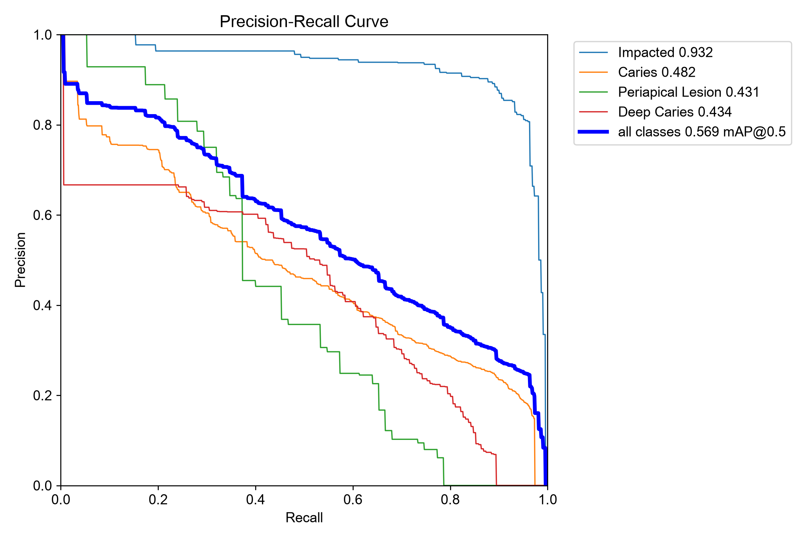
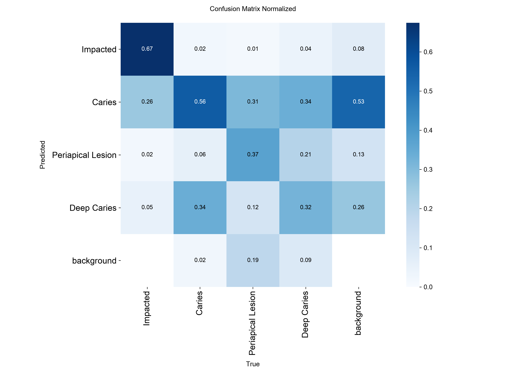
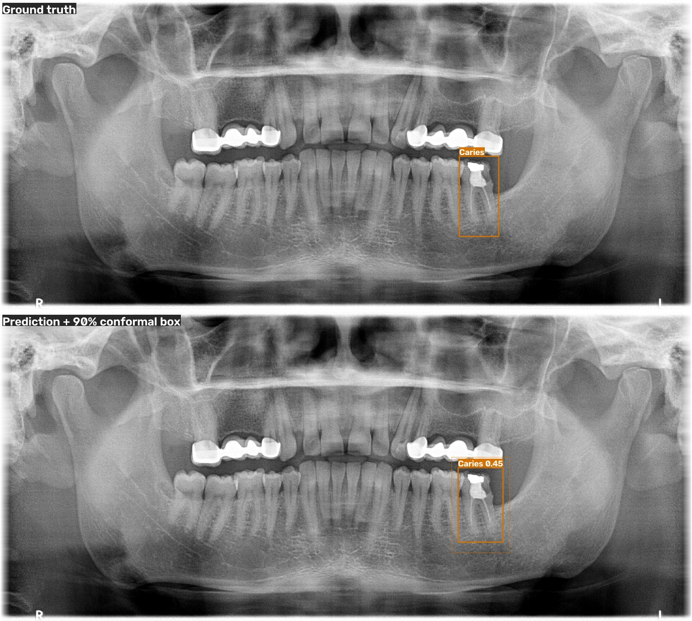
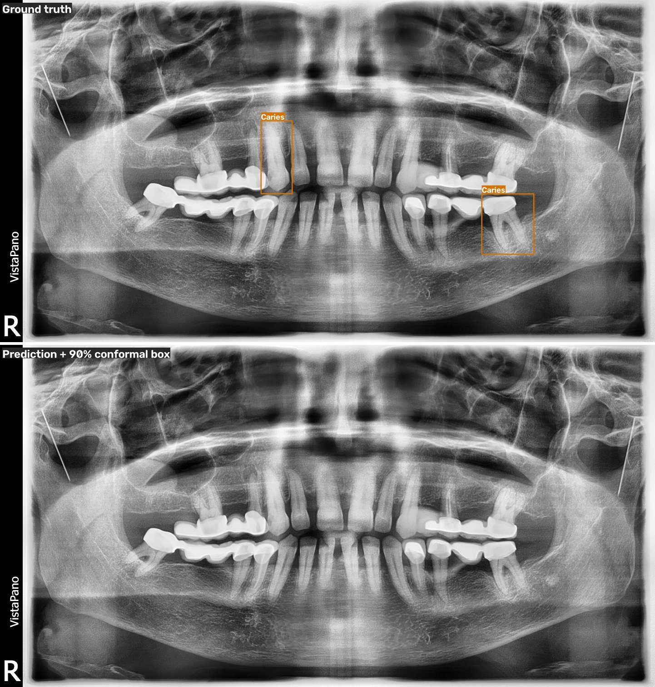

# dentex-tooth-detection

**Uncertainty-aware dental diagnosis detection on panoramic X-rays.**
Fine-tunes Ultralytics **YOLO26** (the latest YOLO release) on the
[DENTEX](https://huggingface.co/datasets/ibrahimhamamci/DENTEX) diagnosis set. It then adds
what most public dental-detection repos don't have: **calibrated confidence, conformal
guarantees, and MC-dropout uncertainty**. It ships with a local web app and a Vercel deployment.

| Diagnosis classes | Impacted · Caries · Periapical Lesion · Deep Caries |
|---|---|
| Detector | YOLO26-s, 1024 px, trained locally on an RTX 3050 Laptop (6 GB) |
| Uncertainty | Platt calibration · split-conformal box intervals · recall-controlling conformal thresholds · MC-dropout |
| **Live demo** | **https://dentex-tooth-detection.vercel.app/** (upload a panoramic X-ray, get findings) |
| Try it locally | Gradio app (`python app/app.py`) · Vercel deployment (`deploy/vercel/`, FastAPI + ONNX Runtime) |

**Contents:** [Results](#results) · [Uncertainty](#uncertainty) · [Try it](#try-it) · [Method](#method) ·
[Reproduce](#reproduce) · [Repository layout](#repository-layout) · [Limitations](#limitations)

---

## Results

### Per-class detection

YOLO26-s, 1024 px, best epoch 43 of 73 (early stopping, patience 30). Trained in 58 min on an RTX 3050 Laptop (6 GB).

**Official validation set** (50 images, original DENTEX diagnosis labels):

| Class | Precision | Recall | AP50 | AP50-95 |
|---|---:|---:|---:|---:|
| Impacted | 0.742 | 0.865 | 0.897 | 0.593 |
| Caries | 0.455 | 0.465 | 0.449 | 0.308 |
| Periapical Lesion | 0.665 | 0.442 | 0.491 | 0.294 |
| Deep Caries | 0.508 | 0.656 | 0.640 | 0.462 |
| **All** | **0.593** | **0.607** | **0.619** | **0.415** |

**Official test set** (250 images, treatment-code labels mapped to diagnoses; see [label audit](#test-label-audit)):

| Class | Precision | Recall | AP50 | AP50-95 |
|---|---:|---:|---:|---:|
| Impacted | 0.853 | 0.928 | 0.932 | 0.586 |
| Caries | 0.497 | 0.427 | 0.482 | 0.335 |
| Periapical Lesion | 0.567 | 0.373 | 0.431 | 0.264 |
| Deep Caries | 0.491 | 0.532 | 0.434 | 0.271 |
| **All** | **0.602** | **0.565** | **0.569** | **0.364** |

Inference: ~8 ms per image at 1024 px on the laptop GPU; ~0.2–0.5 s per image on CPU with ONNX Runtime.

#### Where the errors are

| PR curve (test) | Confusion matrix (test, normalised by true class) |
|---|---|
|  |  |

- **Impacted** teeth are nearly solved (AP50 0.93) and are never lost to background.
- **Caries ↔ Deep Caries** is the dominant confusion (~34% each way). These are adjacent severity grades of the same
  disease, and the boundary is also where the test set's treatment-code labels differ most from DENTEX's.
- **Periapical lesions** are the rarest class (134 training boxes). 19% are missed entirely, which matches their low recall
  ceiling in the conformal analysis below.

Validation-set versions: [PR curve](results/pr_curve_val.png) · [confusion matrix](results/confusion_matrix_val.png).

### Example outputs

Test-set images the model never saw. Top: ground truth. Bottom: prediction (conf ≥ 0.25), with thin outer boxes
showing the 90% conformal box interval.

| Among the best (per-image F1) | Among the worst |
|---|---|
|  |  |

More: [01](assets/examples/01_test_230.jpg) · [02](assets/examples/02_test_197.jpg) ·
[03](assets/examples/03_test_121.jpg) · [05](assets/examples/05_test_127.jpg).

---

## Uncertainty

| | |
|---|---|
|  |  |

All uncertainty components are **fitted on the 100-image `calib` split** (never trained on) and **evaluated on test**.

#### 1. Confidence calibration: per-class Platt scaling

Expected calibration error of detections (conf ≥ 0.05; "correct" = matched at IoU ≥ 0.5):

| Class | Detections | ECE raw | ECE calibrated |
|---|---:|---:|---:|
| Impacted | 272 | 0.164 | 0.103 |
| Caries | 1448 | 0.081 | 0.032 |
| Periapical Lesion | 112 | 0.117 | 0.099 |
| Deep Caries | 318 | 0.108 | 0.093 |
| **All** | **2150** | **0.070** | **0.037** |

Calibration **halves the ECE**. The raw model is over-confident at the top end: detections scored ~0.9 are right only ~67% of the time, which Platt scaling corrects.

#### 2. Conformal box intervals (α = 0.1)

Each detection gets an inner/outer box expanded by `q × box size`. Split-conformal theory says the true box
lies between them for ≥ 90% of detected lesions.

| Class | Margin q | Test coverage | Matched boxes |
|---|---:|---:|---:|
| Impacted | 0.16 | 88.2% | 212 |
| Caries | 0.14 | 92.9% | 504 |
| Periapical Lesion | 0.63 | 100% | 36 |
| Deep Caries | 0.24 | 96.5% | 115 |

Coverage holds within sampling error even though test labels come from a different annotation protocol. Box
uncertainty is largest for periapical lesions, which have diffuse boundaries.

#### 3. Recall-controlling thresholds: "miss at most α of lesions"

A per-class confidence threshold fitted so that ≥ 1 − α of calib lesions are kept. This is only **feasible** when the
detector finds at least that many lesions at all (its recall ceiling, measured on calib at conf ≥ 0.05, IoU ≥ 0.5):

| Class | Calib recall ceiling | α = 0.1 (target 90%) | α = 0.5 (target 50%) | Fixed conf 0.25 |
|---|---:|---|---|---|
| Impacted | 95.4% | thr 0.40 → **recall 88.7%, precision 87.1%** | thr 0.75 → recall 48.0%, precision 93.8% | recall 91.4%, precision 85.6% |
| Caries | 66.3% | infeasible | thr 0.17 → recall 50.2%, precision 47.1% | recall 43.0%, precision 50.3% |
| Periapical Lesion | 54.2% | infeasible | thr 0.07 → recall 42.7%, precision 35.6% | recall 37.3%, precision 54.9% |
| Deep Caries | 55.2% | infeasible | thr 0.26 → recall 54.2%, precision 51.5% | recall 55.3%, precision 51.0% |

**Takeaway.** The conformal analysis makes explicit what a fixed 0.25 threshold hides. For impacted teeth you can
promise "≤ 10% missed" at 87% precision. For caries and lesions, **no threshold can deliver 90% sensitivity with this
detector**, because about a third or more of those lesions are never localised at IoU ≥ 0.5. That points to the next
improvements: higher resolution or tiling for small lesions, and tooth-level crops. Periapical lesions fall short even at α = 0.5
(42.7% vs 50%). With only 24 calib instances the finite-sample guarantee is loose, and the test protocol shift matters more.

#### 4. MC-dropout

A dropout-augmented copy of the model (fine-tuned 30 epochs; validation mAP50 0.61 vs 0.62 baseline) is sampled T = 20 times
per image, and the stochastic detections are fused.

**Accuracy (AP50 on test, own matching code):**

| Model | Impacted | Caries | Periapical Lesion | Deep Caries | Mean |
|---|---:|---:|---:|---:|---:|
| Baseline (single pass) | 0.924 | 0.463 | 0.405 | 0.397 | **0.547** |
| Dropout model, single pass | 0.912 | 0.433 | 0.438 | 0.344 | 0.532 |
| MC-dropout, T = 20 fused | 0.879 | 0.384 | 0.397 | 0.325 | 0.496 |

**Does uncertainty flag false positives?** (AUROC over test detections with conf ≥ 0.05; 0.5 = chance)

| Signal | AUROC |
|---|---:|
| Baseline: 1 − confidence | 0.767 |
| MC-dropout: 1 − mean confidence | **0.818** |
| MC-dropout: 1 − detection frequency | 0.720 |
| MC-dropout: box std | 0.644 |
| MC-dropout: class entropy | 0.517 |
| MC-dropout: predictive entropy (incl. background) | 0.240 (inverted) |

**Takeaways.**
- **Better at flagging errors:** averaging over 20 stochastic passes ranks false positives better than a single pass (AUROC
  0.818 vs 0.767). Detections that appear in only some passes are more likely to be wrong.
- **But less accurate:** fusing the passes lowers AP50 (0.496 vs 0.547), so MC-dropout is best used as a *review flag* on top of baseline
  detections, which is what the apps do, not as the detector itself.
- **Entropy signals:**
  - Predictive entropy that includes the background share is *inverted* (0.24). Weak false positives are dominated by
    background mass and look "certain".
  - Class entropy (disagreement over which diagnosis) is near chance for spotting false positives. It is still useful for
    flagging diagnosis ambiguity such as Caries vs Deep Caries.

---

## Try it

### Where the data is

After `download_data.py` and `prepare_data.py`:

| Path | Contents |
|---|---|
| `data/raw/` | original DENTEX zips and extracted folders |
| `data/yolo/images/{train,calib,val,test}/` | converted images per split (labels in `data/yolo/labels/`) |
| `data/yolo/dentex.yaml` | Ultralytics dataset config |
| `data/yolo/images/test/*.png` | 250 unseen panoramic X-rays, good for trying the apps |

### Local web app (Gradio, uses your GPU)

```bash
python app/app.py        # open http://127.0.0.1:7860
```

Upload a panoramic X-ray, or pick a test-set example. The app returns:
- the annotated image
- a findings table: diagnosis, calibrated confidence, approximate FDI quadrant, status, 90% conformal box interval
- a plain-language summary of each finding

Turn on **MC-dropout** to add, for each finding:
- how often it appears across stochastic passes
- its diagnosis (class) entropy
- the dropout model's class

Findings where the two models disagree on the diagnosis are flagged for review.

### Deploy to Vercel

Vercel can't host PyTorch (the Python function bundle limit is 500 MB and there's no GPU), so `deploy/vercel/` contains a torch-free
build: FastAPI + ONNX Runtime plus a static upload page.
- Preprocessing matches Ultralytics exactly. On 10 test images, 93 of 93 boxes match at IoU ≥ 0.9, with a max confidence difference of 0.001.
- Platt calibration and conformal intervals therefore carry over unchanged.
- The page downsizes images in the browser to stay under Vercel's 4.5 MB request limit.
- MC-dropout is local-only; 20 CPU passes per request would be too slow.

```bash
python scripts/export_onnx.py      # writes deploy/vercel/model/{dentex_yolo26s.onnx, meta.json}
cd deploy/vercel && vercel --prod  # or import the repo in Vercel with Root Directory = deploy/vercel
```

Test it locally with `pip install -r deploy/vercel/requirements.txt uvicorn`, then `cd deploy/vercel && uvicorn app:app`
(open http://127.0.0.1:8000). API: `POST /api/predict` (multipart `file`), `GET /api/health`, docs at `/api/docs`.
See [`deploy/vercel/README.md`](deploy/vercel/README.md).

---

## Method

### Data
- **train / calib**: the 705 fully-annotated DENTEX training images, split (stratified by rarest class) into
  605 for training and **100 held out for calibration**. Calibration images are never trained on.
- **val**: official 50-image validation set (model selection).
- **test**: official 250-image test set. Its labels are released as LabelMe polygons with Turkish
  **treatment-planning codes**, not the four challenge diagnoses. They are converted to boxes and mapped using the audit below.

#### Test-label audit

`scripts/audit_test_labels.py` matches every test polygon (all codes) to the best-overlapping baseline prediction
(conf ≥ 0.25, IoU ≥ 0.3) and tabulates which class the model predicts (% of shapes):

| Test code | Shapes | Impacted | Caries | Periapical | Deep Caries | No detection | Mapped to |
|---|---:|---:|---:|---:|---:|---:|---|
| 6 gömülü (impacted) | 221 | **91.9** | 1.4 | 0.0 | 1.4 | 5.4 | Impacted |
| 1 çürük (caries) | 747 | 0.9 | **43.4** | 0.3 | 5.6 | 49.8 | Caries |
| 7 lezyon (lesion) | 75 | 0.0 | 10.7 | **36.0** | 17.3 | 36.0 | Periapical Lesion |
| 3 kanal (root canal) | 161 | 1.9 | 19.3 | 6.8 | **49.1** | 23.0 | Deep Caries |
| 5 çekim (extraction) | 29 | 0.0 | 0.0 | 10.3 | **65.5** | 24.1 | Deep Caries |
| 2 küretaj (curettage) | 265 | 0.0 | 5.3 | 0.4 | 2.3 | **92.1** | dropped |
| 0 sağlam (healthy) | 91 | 2.2 | 5.5 | 0.0 | 0.0 | **92.3** | dropped |
| 8 kırık (fracture) | 11 | 0.0 | 0.0 | 0.0 | 9.1 | **90.9** | dropped |

Clinically this is consistent: deep caries is what gets root-canal treatment or extraction, while küretaj is
periodontal curettage. **Caveat:** the Deep Caries mapping was chosen after looking at test-set predictions, so treat
test numbers for that class as optimistic. The validation set, which uses the original labels, is the clean reference.

### Uncertainty quantification (`src/dentex/uncertainty/`)
1. **Confidence calibration.** Per-class Platt scaling fitted on `calib`; ECE and reliability diagram on `test`.
2. **Conformal box intervals.** Nonconformity = max |pred − GT| coordinate residual normalised by box size.
   The finite-sample (1−α) quantile per class gives inner/outer boxes that contain the true box for ≥ 90% of
   detected lesions (exchangeability assumption).
3. **Recall-controlling thresholds.** Per class, the confidence threshold that misses ≤ α of lesions on `calib`
   (with finite-sample correction), e.g. *"at most 10% of caries missed"*. Reported as infeasible when the detector's recall
   ceiling is below the target.
4. **MC-dropout.** YOLO26 has no dropout, so `Dropout2d(p=0.1)` is inserted before all 12 detection-head output convs and the
   model is fine-tuned for 30 epochs with it. At inference, T=20 stochastic passes are clustered, class-agnostically, into
   detections with:
   - mean score
   - detection frequency
   - predictive entropy (including background)
   - **class entropy** (disagreement over the four diagnoses)
   - box std

   Each signal is scored by its AUROC for flagging false positives.

---

## Reproduce

```bash
conda create -n dentex python=3.12 -y && conda activate dentex
pip install torch torchvision --index-url https://download.pytorch.org/whl/cu128
pip install -r requirements.txt && pip install -e .

python scripts/download_data.py                 # ~12 GB from Hugging Face
python scripts/prepare_data.py                  # -> data/yolo (train/calib/val/test)
python -m dentex.train --config configs/train.yaml
python -m dentex.evaluate --weights runs/dentex/yolo26s_baseline/weights/best.pt --split val
python -m dentex.evaluate --weights runs/dentex/yolo26s_baseline/weights/best.pt --split test
python scripts/audit_test_labels.py --weights runs/dentex/yolo26s_baseline/weights/best.pt
python -m dentex.train --config configs/train_mcdropout.yaml
python scripts/run_uncertainty.py \
    --weights runs/dentex/yolo26s_baseline/weights/best.pt \
    --mc-weights runs/dentex/yolo26s_mcdropout/weights/best.pt
python scripts/export_onnx.py                   # model for deploy/vercel
pytest                                          # 17 unit tests
python app/app.py                               # local web app
```

## Repository layout
```
app/app.py                 Gradio web app (upload X-ray -> findings, calibration, conformal intervals, MC-dropout)
configs/                   training configs (baseline, MC-dropout fine-tune)
deploy/vercel/             Vercel deployment: FastAPI + ONNX Runtime API, upload page, ONNX model + calibration metadata
scripts/                   download, prepare, test-label audit, uncertainty evaluation, ONNX export
src/dentex/                conversion, splits, training, evaluation, visualisation
src/dentex/uncertainty/    matching + AP, conformal prediction + calibration, MC-dropout
tests/                     unit tests (conversion, conformal guarantees, matching, MC-dropout)
results/  assets/          generated metrics, plots and example predictions
```

## Limitations
- Small dataset (605 training images) and strong class imbalance (134 periapical-lesion training boxes).
- The official test labels use a different, treatment-based protocol. The Deep Caries mapping was informed by test predictions;
  validation numbers are the clean reference.
- Conformal guarantees are marginal (per class, on average over images) and assume calibration and test images are
  exchangeable, which the test label shift weakens.
- MC-dropout needs a separately fine-tuned model whose scores sit on a different scale. In the apps it annotates baseline
  findings rather than replacing them, and it isn't available on the Vercel CPU deployment.
- Research code. **Not a medical device** and not for clinical use. DENTEX data and derived weights are CC BY-NC-SA 4.0
  (non-commercial).

## Citation
```bibtex
@article{hamamci2023dentex,
  title   = {DENTEX: An Abnormal Tooth Detection with Dental Enumeration and Diagnosis Benchmark for Panoramic X-rays},
  author  = {Hamamci, Ibrahim Ethem and Er, Sezgin and Simsar, Enis and others},
  journal = {arXiv preprint arXiv:2305.19112},
  year    = {2023}
}
```
Detector: [Ultralytics YOLO26](https://docs.ultralytics.com/models/yolo26/). Code: MIT. Data: CC BY-NC-SA 4.0.
