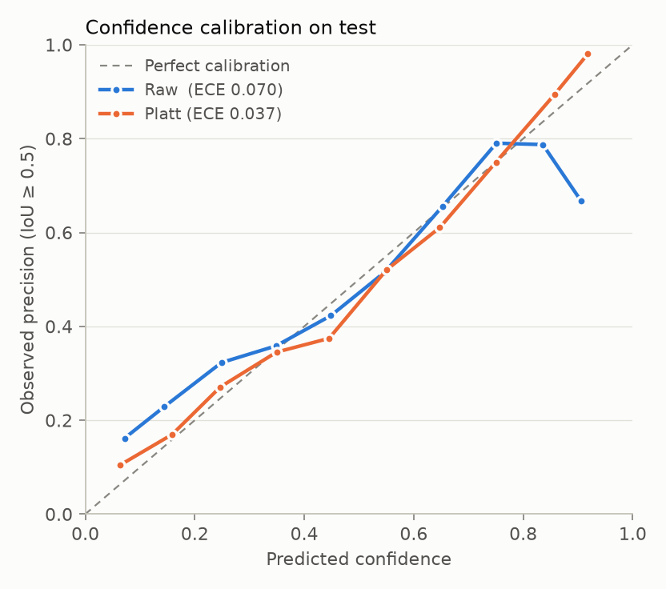
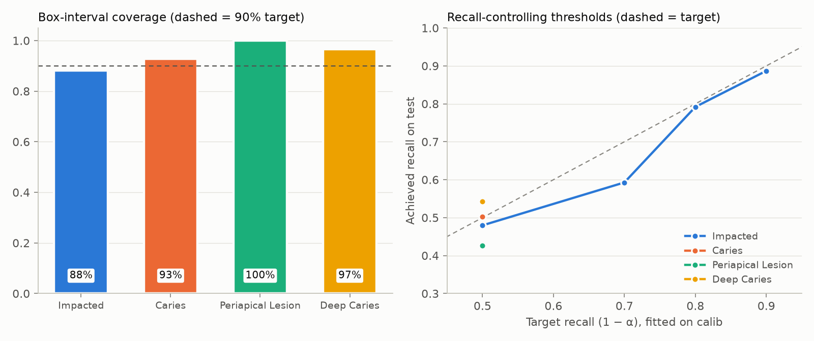

# dentex-tooth-detection

**Uncertainty-aware dental diagnosis detection on panoramic X-rays.**
Fine-tunes Ultralytics **YOLO26** (the latest YOLO release) on the
[DENTEX](https://huggingface.co/datasets/ibrahimhamamci/DENTEX) diagnosis set. It then adds
what most public dental-detection repos don't have: **calibrated confidence, conformal
guarantees, and MC-dropout uncertainty**.

| Diagnosis classes | Impacted · Caries · Periapical Lesion · Deep Caries |
|---|---|
| Detector | YOLO26-s, 1024 px, trained locally on an RTX 3050 Laptop (6 GB) |
| Uncertainty | Platt calibration · split-conformal box intervals · recall-controlling conformal thresholds · MC-dropout |

> Results tables and example images below are filled in by the pipeline (`results/`, `assets/examples/`).

---

## Results

### Per-class detection

YOLO26-s, 1024 px, best epoch 43 of 73 (early stopping, patience 30). Trained in 58 min on an RTX 3050 Laptop (6 GB).

**Official validation set** (50 images, original DENTEX diagnosis labels):

| Class | Precision | Recall | AP50 | AP50-95 |
|---|---:|---:|---:|---:|
| Impacted | 0.742 | 0.865 | 0.897 | 0.593 |
| Caries | 0.455 | 0.465 | 0.449 | 0.308 |
| Periapical Lesion | 0.665 | 0.442 | 0.491 | 0.294 |
| Deep Caries | 0.508 | 0.656 | 0.640 | 0.462 |
| **All** | **0.593** | **0.607** | **0.619** | **0.415** |

**Official test set** (250 images, treatment-code labels mapped to diagnoses; see [label audit](#test-label-audit)):

| Class | Precision | Recall | AP50 | AP50-95 |
|---|---:|---:|---:|---:|
| Impacted | 0.853 | 0.928 | 0.932 | 0.586 |
| Caries | 0.497 | 0.427 | 0.482 | 0.335 |
| Periapical Lesion | 0.567 | 0.373 | 0.431 | 0.264 |
| Deep Caries | 0.491 | 0.532 | 0.434 | 0.271 |
| **All** | **0.602** | **0.565** | **0.569** | **0.364** |

Inference: ~8 ms per image at 1024 px on the laptop GPU.

### Example outputs

Top: ground truth. Bottom: prediction, with the thin outer box showing the 90% conformal box interval.

<!-- assets/examples/*.jpg -->

### Uncertainty

| | |
|---|---|
|  |  |

_Pending._

---

## Method

### Data
- **train / calib**: the 705 fully-annotated DENTEX training images, split (stratified by rarest class) into
  ~605 for training and **100 held out for calibration**. Calibration images are never trained on.
- **val**: official 50-image validation set (model selection).
- **test**: official 250-image test set. Its labels are released as LabelMe polygons with Turkish
  **treatment-planning codes**, not the four challenge diagnoses. They are converted to boxes and mapped using the audit below.

#### Test-label audit

`scripts/audit_test_labels.py` matches every test polygon (all codes) to the best-overlapping baseline prediction
(conf ≥ 0.25, IoU ≥ 0.3) and tabulates which class the model predicts (% of shapes):

| Test code | Shapes | Impacted | Caries | Periapical | Deep Caries | No detection | Mapped to |
|---|---:|---:|---:|---:|---:|---:|---|
| 6 gömülü (impacted) | 221 | **91.9** | 1.4 | 0.0 | 1.4 | 5.4 | Impacted |
| 1 çürük (caries) | 747 | 0.9 | **43.4** | 0.3 | 5.6 | 49.8 | Caries |
| 7 lezyon (lesion) | 75 | 0.0 | 10.7 | **36.0** | 17.3 | 36.0 | Periapical Lesion |
| 3 kanal (root canal) | 161 | 1.9 | 19.3 | 6.8 | **49.1** | 23.0 | Deep Caries |
| 5 çekim (extraction) | 29 | 0.0 | 0.0 | 10.3 | **65.5** | 24.1 | Deep Caries |
| 2 küretaj (curettage) | 265 | 0.0 | 5.3 | 0.4 | 2.3 | **92.1** | dropped |
| 0 sağlam (healthy) | 91 | 2.2 | 5.5 | 0.0 | 0.0 | **92.3** | dropped |
| 8 kırık (fracture) | 11 | 0.0 | 0.0 | 0.0 | 9.1 | **90.9** | dropped |

Clinically this is consistent: deep caries is what gets root-canal treatment or extraction, while küretaj is
periodontal curettage. **Caveat:** the Deep Caries mapping was chosen after looking at test-set predictions, so treat
test numbers for that class as optimistic. The validation set, which uses the original labels, is the clean reference.

### Uncertainty quantification (`src/dentex/uncertainty/`)
1. **Confidence calibration.** Per-class Platt scaling fitted on `calib`; ECE and reliability diagram on `test`.
2. **Conformal box intervals.** Nonconformity = max |pred − GT| coordinate residual normalised by box size.
   The finite-sample (1−α) quantile per class gives inner/outer boxes that contain the true box for ≥ 90% of
   detected lesions (exchangeability assumption).
3. **Recall-controlling thresholds.** Per class, the confidence threshold that misses ≤ α of lesions on `calib`
   (with finite-sample correction), e.g. *"at most 10% of caries missed"*. This replaces an arbitrary 0.25 cut-off.
4. **MC-dropout.** YOLO26 has no dropout, so `Dropout2d(p=0.1)` is inserted before every head output conv and the model is
   briefly fine-tuned with it. At inference, T=20 stochastic passes are clustered into detections with mean score,
   detection frequency, predictive entropy and box std. Reported as AUROC for flagging false positives.

---

## Reproduce

```bash
conda create -n dentex python=3.12 -y && conda activate dentex
pip install torch torchvision --index-url https://download.pytorch.org/whl/cu128
pip install -r requirements.txt && pip install -e .

python scripts/download_data.py                 # ~12 GB from Hugging Face
python scripts/prepare_data.py                  # -> data/yolo (train/calib/val/test)
python -m dentex.train --config configs/train.yaml
python -m dentex.evaluate --weights runs/dentex/yolo26s_baseline/weights/best.pt --split test
python -m dentex.train --config configs/train_mcdropout.yaml
python scripts/run_uncertainty.py \
    --weights runs/dentex/yolo26s_baseline/weights/best.pt \
    --mc-weights runs/dentex/yolo26s_mcdropout/weights/best.pt
pytest
```

## Repository layout
```
configs/            training configs (baseline, MC-dropout fine-tune)
scripts/            download, prepare, uncertainty evaluation
src/dentex/         conversion, splits, training, evaluation, visualisation
src/dentex/uncertainty/  matching, conformal prediction + calibration, MC-dropout
tests/              unit tests (conversion, conformal guarantees, matching)
results/  assets/   generated metrics, plots and example predictions
```

## Limitations
- Small dataset (~600 training images) and strong class imbalance (few periapical lesions).
- Conformal guarantees are marginal (per class, on average over images) and assume calibration and test images are
  exchangeable. The test set comes from the same challenge but was annotated with a different label format.
- Research code. **Not a medical device** and not for clinical use.

## Citation
```bibtex
@article{hamamci2023dentex,
  title   = {DENTEX: An Abnormal Tooth Detection with Dental Enumeration and Diagnosis Benchmark for Panoramic X-rays},
  author  = {Hamamci, Ibrahim Ethem and Er, Sezgin and Simsar, Enis and others},
  journal = {arXiv preprint arXiv:2305.19112},
  year    = {2023}
}
```
Detector: [Ultralytics YOLO26](https://docs.ultralytics.com/models/yolo26/). Code: MIT. Data: CC BY-NC-SA 4.0.
